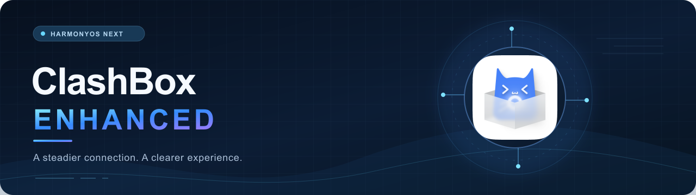

<div align="center">



[](https://github.com/ykandbl/ClashBox-Enhanced/releases) [](https://github.com/ykandbl/ClashBox-Enhanced/releases/tag/v2.0.0) [](https://www.harmonyos.com/)

**HarmonyOS NEXT · Stable VPN paths · Open build chain**

[中文](#中文) · [English](#english) · [Releases](https://github.com/ykandbl/ClashBox-Enhanced/releases) · [Original project](https://github.com/xiaobaigroup/ClashBox)

</div>

> [!NOTE]
> GitHub Releases contain unsigned HAP packages. Sign them with your own HarmonyOS credentials before installing.

## 中文

ClashBox Enhanced 是 ClashBox 的自维护分支，面向 HarmonyOS NEXT。它保留原项目的 UI、协作者和开源致谢，把长期使用中最容易出问题的 VPN 生命周期、订阅更新、节点测试和兼容场景整理成了一条更稳定的维护线。

### 这条分支解决了什么

| 方向 | 现在的体验 |
| --- | --- |
| VPN 生命周期 | 冷启动、快速启停、切后台、回到前台和 Wi‑Fi/蜂窝切换时更稳定 |
| 长连接 | 减少 Telegram、ChatGPT 等应用出现“正在发送”、无响应或反复重连 |
| 订阅更新 | 兼容更多格式；失败时保留可用配置；阻止旧失败状态造成重试风暴 |
| 节点测试 | 批量测速的并发、进度和页面切换状态更可靠 |
| 核心网络 | 维护 TUN、DNS、IPv6、MTU、socket protect 和 TCP 长连接适配 |
| 发布方式 | 源码公开，Release 提供未签名 HAP，用户使用自己的签名材料安装 |

### 我们维护的后端

原项目 README 提到，改版后的 ClashMate 后端没有随前端仓库开放。这个分支公开的是一套可以从源码构建的 HarmonyOS 后端适配链：

- Go 与 N-API 封装的 `libflclash`；
- Mihomo 核心和固定版本的 gVisor 子模块；
- HarmonyOS TUN、VPN Extension、IPC 和 socket protect；
- 订阅加载、配置校验、节点切换、测速和连接诊断；
- HarmonyOS 专用补丁、版本锁定和公开构建脚本。

这不是把原作者未公开的后端二进制拆出来，而是把本分支实际维护的后端实现、补丁和构建方式整理成可复现的源码工程。预编译 native 二进制不放进 Git，构建脚本会在本地生成它。

```text
UI / ArkTS
    └── VPN Extension + IPC + socket protect
          └── Go / N-API bridge
                └── Mihomo + gVisor
                      └── TUN → proxy node → Internet
```

### 快速开始

```bash
git clone --recurse-submodules https://github.com/ykandbl/ClashBox-Enhanced.git
cd ClashBox-Enhanced
./scripts/build-public-unsigned.sh
```

下载现成包：

1. 打开 [v2.0.0 Release](https://github.com/ykandbl/ClashBox-Enhanced/releases/tag/v2.0.0)。
2. 下载 `ClashBox-Enhanced-v2.0.0-unsigned.hap.gz`。
3. 解压：`gunzip ClashBox-Enhanced-v2.0.0-unsigned.hap.gz`。
4. 用自己的 HarmonyOS 签名材料签名并安装。

版本分界和历史记录见 [RELEASE_HISTORY.md](RELEASE_HISTORY.md)：`2.0.0` 起为本分支自维护版本，`1.7.4` 是本地 Git 历史中可追溯的原项目基线。

### 发布前检查

```bash
node scripts/audit-public-snapshot.cjs
node scripts/test-p0-regression.cjs
node scripts/test-bitz-subscription.cjs
node scripts/verify-stability-invariants.cjs
node scripts/test-rpc-socket-lifecycle.cjs
```

## English

ClashBox Enhanced is a community-maintained continuation of ClashBox for HarmonyOS NEXT. It keeps the original UI, contributors and acknowledgements, while focusing the project on stable VPN lifecycles, subscription recovery, node testing and real-world compatibility.

### What changed

| Area | User-facing result |
| --- | --- |
| VPN lifecycle | More reliable cold start, rapid restart, background return and network handover |
| Long-lived connections | Fewer stuck sends, silent uploads and reconnect loops in Telegram, ChatGPT and similar apps |
| Subscriptions | More formats supported; failed refreshes keep the last working configuration; stale retries are suppressed |
| Node testing | More consistent concurrency, progress reporting and state across navigation |
| Core networking | Maintained TUN, DNS, IPv6, MTU, socket protection and TCP stream behavior |
| Distribution | Source-first project with unsigned HAP releases for user-side signing |

### The backend in this branch

The original project README says that its modified ClashMate backend was not distributed with the frontend repository. This branch publishes a reproducible HarmonyOS backend toolchain:

- the Go and N-API wrapper used to build `libflclash`;
- pinned Mihomo and gVisor submodules;
- the HarmonyOS TUN, VPN Extension, IPC and socket-protection layers;
- subscription loading, configuration validation, node switching, speed tests and connection diagnostics;
- HarmonyOS patches, version locks and public build scripts.

This is not a dump of the original author’s private backend binary. It is the source implementation and build chain maintained in this branch. The native binary is intentionally excluded from Git and built locally when needed.

### Build from source

```bash
git clone --recurse-submodules https://github.com/ykandbl/ClashBox-Enhanced.git
cd ClashBox-Enhanced
./scripts/build-public-unsigned.sh
```

The script installs module dependencies and builds the pinned native core when the local binary is absent. The output is `entry/build/release/outputs/default/entry-default-unsigned.hap`.

GitHub Releases contain unsigned HAP packages. Sign them with your own HarmonyOS signing materials before installing. No maintainer signing keys, Huawei developer credentials, subscriptions, account data or device data are included.

### Credits

This branch uses and credits Mihomo, gVisor, FlClash and other dependencies. Please read the license files in their respective directories. Contributors from the original and upstream projects remain credited in the app’s About page and source tree.
